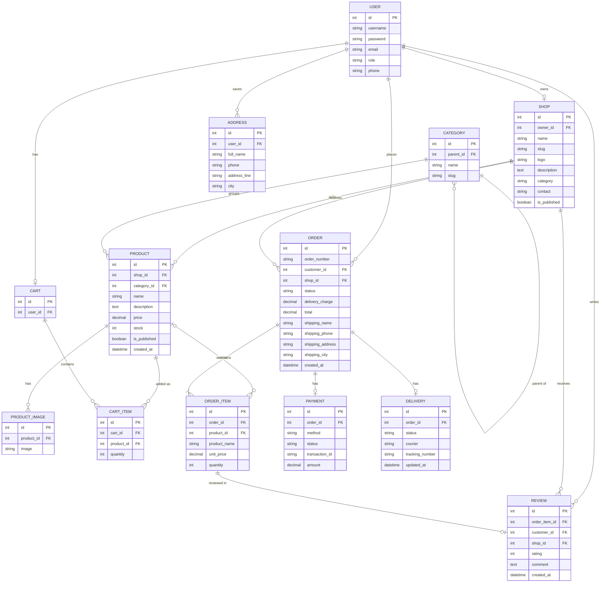

# ER Diagram: MarketFlow

```mermaid
erDiagram
    USER ||--o| SHOP : owns
    USER ||--o{ ADDRESS : saves
    USER ||--o| CART : has
    USER ||--o{ ORDER : places
    USER ||--o{ REVIEW : writes
    SHOP ||--o{ PRODUCT : sells
    SHOP ||--o{ ORDER : receives
    SHOP ||--o{ REVIEW : receives
    CATEGORY ||--o{ PRODUCT : groups
    CATEGORY ||--o{ CATEGORY : "parent of"
    PRODUCT ||--o{ PRODUCT_IMAGE : has
    PRODUCT ||--o{ CART_ITEM : "added as"
    PRODUCT |o--o{ ORDER_ITEM : "sold as"
    CART ||--o{ CART_ITEM : contains
    ORDER ||--|{ ORDER_ITEM : contains
    ORDER ||--o| PAYMENT : has
    ORDER ||--o| DELIVERY : has
    ORDER_ITEM ||--o| REVIEW : "reviewed in"

    USER {
        int id PK
        string username
        string password
        string email
        string role
        string phone
    }
    SHOP {
        int id PK
        int owner_id FK
        string name
        string slug
        string logo
        text description
        string category
        string contact
        boolean is_published
    }
    CATEGORY {
        int id PK
        int parent_id FK
        string name
        string slug
    }
    PRODUCT {
        int id PK
        int shop_id FK
        int category_id FK
        string name
        text description
        decimal price
        int stock
        boolean is_published
        datetime created_at
    }
    PRODUCT_IMAGE {
        int id PK
        int product_id FK
        string image
    }
    ADDRESS {
        int id PK
        int user_id FK
        string full_name
        string phone
        string address_line
        string city
    }
    CART {
        int id PK
        int user_id FK
    }
    CART_ITEM {
        int id PK
        int cart_id FK
        int product_id FK
        int quantity
    }
    ORDER {
        int id PK
        string order_number
        int customer_id FK
        int shop_id FK
        string status
        decimal delivery_charge
        decimal total
        string shipping_name
        string shipping_phone
        string shipping_address
        string shipping_city
        datetime created_at
    }
    ORDER_ITEM {
        int id PK
        int order_id FK
        int product_id FK
        string product_name
        decimal unit_price
        int quantity
    }
    PAYMENT {
        int id PK
        int order_id FK
        string method
        string status
        string transaction_id
        decimal amount
    }
    DELIVERY {
        int id PK
        int order_id FK
        string status
        string courier
        string tracking_number
        datetime updated_at
    }
    REVIEW {
        int id PK
        int order_item_id FK
        int customer_id FK
        int shop_id FK
        int rating
        text comment
        datetime created_at
    }
```